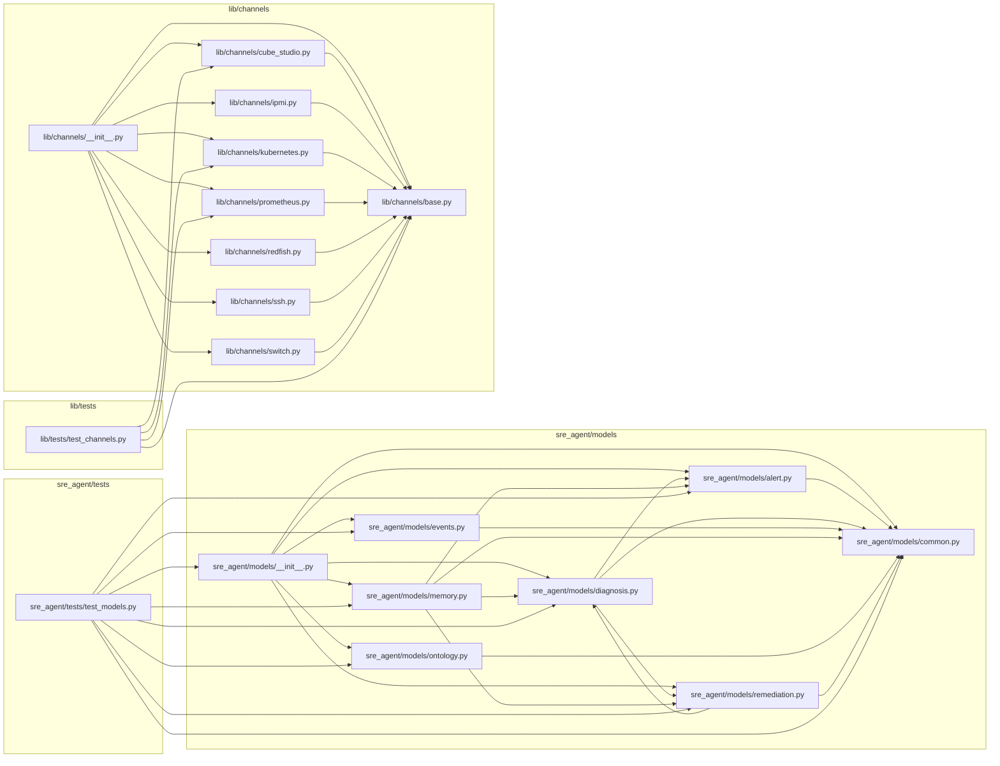

# SRE Models Dependency Audit

## Data Sources & Scope
- Implemented dependency graph source: static AST import scan across `sre_agent/**/*.py` and `lib/**/*.py` (read-only, current working tree).
- Planned consumer source: `AIDC-auto-SRE.md` and `aidc-auto-sre-plan-multi-agents.md` contract/plan references.
- Core graph scope for this report section: `sre_agent/models/*`, `sre_agent/tests/*`, `lib/channels/*`, `lib/tests/*`.
- Out-of-scope in the core graph section: third-party/std-lib imports and repository paths outside the four scoped roots.

## Current Internal Dependency Graph

### Module-level graph (scoped)

### File-level edge table (generated from real imports)
| Source | Target | Line | Edge Type | Import |
|---|---|---:|---|---|
| `lib/channels/__init__.py` | `lib/channels/base.py` | 3 | runtime | `from lib.channels.base import BaseChannel, ChannelResult, SafetyViolationError` |
| `lib/channels/__init__.py` | `lib/channels/cube_studio.py` | 4 | runtime | `from lib.channels.cube_studio import CubeStudioChannel, build_auth_header` |
| `lib/channels/__init__.py` | `lib/channels/ipmi.py` | 5 | runtime | `from lib.channels.ipmi import IPMIChannel` |
| `lib/channels/__init__.py` | `lib/channels/kubernetes.py` | 6 | runtime | `from lib.channels.kubernetes import K8sChannel` |
| `lib/channels/__init__.py` | `lib/channels/prometheus.py` | 7 | runtime | `from lib.channels.prometheus import PrometheusChannel` |
| `lib/channels/__init__.py` | `lib/channels/redfish.py` | 8 | runtime | `from lib.channels.redfish import RedfishChannel` |
| `lib/channels/__init__.py` | `lib/channels/ssh.py` | 9 | runtime | `from lib.channels.ssh import SSHChannel` |
| `lib/channels/__init__.py` | `lib/channels/switch.py` | 10 | runtime | `from lib.channels.switch import SwitchChannel` |
| `lib/channels/cube_studio.py` | `lib/channels/base.py` | 16 | runtime | `from .base import BaseChannel, ChannelResult` |
| `lib/channels/ipmi.py` | `lib/channels/base.py` | 10 | runtime | `from lib.channels.base import BaseChannel, ChannelResult` |
| `lib/channels/kubernetes.py` | `lib/channels/base.py` | 7 | runtime | `from .base import BaseChannel, ChannelResult, SafetyViolationError` |
| `lib/channels/prometheus.py` | `lib/channels/base.py` | 11 | runtime | `from .base import BaseChannel, ChannelResult` |
| `lib/channels/redfish.py` | `lib/channels/base.py` | 13 | runtime | `from lib.channels.base import BaseChannel, ChannelResult, SafetyViolationError` |
| `lib/channels/ssh.py` | `lib/channels/base.py` | 15 | runtime | `from lib.channels.base import BaseChannel, ChannelResult, SafetyViolationError` |
| `lib/channels/switch.py` | `lib/channels/base.py` | 19 | runtime | `from lib.channels.base import BaseChannel, ChannelResult` |
| `lib/tests/test_channels.py` | `lib/channels/base.py` | 7 | test-only | `from lib.channels.base import BaseChannel, ChannelResult, SafetyViolationError` |
| `lib/tests/test_channels.py` | `lib/channels/cube_studio.py` | 8 | test-only | `from lib.channels.cube_studio import CubeStudioChannel, build_auth_header` |
| `lib/tests/test_channels.py` | `lib/channels/kubernetes.py` | 9 | test-only | `from lib.channels.kubernetes import K8sChannel` |
| `lib/tests/test_channels.py` | `lib/channels/prometheus.py` | 10 | test-only | `from lib.channels.prometheus import PrometheusChannel` |
| `sre_agent/models/__init__.py` | `sre_agent/models/alert.py` | 3 | runtime | `from sre_agent.models.alert import Alert, AlertSeverity, AlertStatus` |
| `sre_agent/models/__init__.py` | `sre_agent/models/common.py` | 4 | runtime | `from sre_agent.models.common import ErrorCode, SREError, SREResponse, SafetyLevel, StrictFrozenModel` |
| `sre_agent/models/__init__.py` | `sre_agent/models/diagnosis.py` | 5 | runtime | `from sre_agent.models.diagnosis import (` |
| `sre_agent/models/__init__.py` | `sre_agent/models/events.py` | 15 | runtime | `from sre_agent.models.events import EventType, WSEvent` |
| `sre_agent/models/__init__.py` | `sre_agent/models/memory.py` | 16 | runtime | `from sre_agent.models.memory import ConfigBaseline, IncidentRecord, LearnedPattern` |
| `sre_agent/models/__init__.py` | `sre_agent/models/ontology.py` | 17 | runtime | `from sre_agent.models.ontology import EntityType, OntologyEdge, OntologyNode, RelationType, Relationship` |
| `sre_agent/models/__init__.py` | `sre_agent/models/remediation.py` | 18 | runtime | `from sre_agent.models.remediation import (` |
| `sre_agent/models/alert.py` | `sre_agent/models/common.py` | 11 | runtime | `from sre_agent.models.common import StrictFrozenModel` |
| `sre_agent/models/diagnosis.py` | `sre_agent/models/alert.py` | 11 | runtime | `from sre_agent.models.alert import Alert` |
| `sre_agent/models/diagnosis.py` | `sre_agent/models/common.py` | 12 | runtime | `from sre_agent.models.common import StrictFrozenModel` |
| `sre_agent/models/diagnosis.py` | `sre_agent/models/remediation.py` | 13 | runtime | `from sre_agent.models.remediation import RemediationPlan` |
| `sre_agent/models/events.py` | `sre_agent/models/common.py` | 11 | runtime | `from sre_agent.models.common import StrictFrozenModel` |
| `sre_agent/models/memory.py` | `sre_agent/models/alert.py` | 10 | runtime | `from sre_agent.models.alert import Alert` |
| `sre_agent/models/memory.py` | `sre_agent/models/common.py` | 11 | runtime | `from sre_agent.models.common import StrictFrozenModel` |
| `sre_agent/models/memory.py` | `sre_agent/models/diagnosis.py` | 12 | runtime | `from sre_agent.models.diagnosis import Hypothesis` |
| `sre_agent/models/memory.py` | `sre_agent/models/remediation.py` | 13 | runtime | `from sre_agent.models.remediation import RemediationPlan` |
| `sre_agent/models/ontology.py` | `sre_agent/models/common.py` | 11 | runtime | `from sre_agent.models.common import StrictFrozenModel` |
| `sre_agent/models/remediation.py` | `sre_agent/models/common.py` | 9 | runtime | `from sre_agent.models.common import SafetyLevel, StrictFrozenModel` |
| `sre_agent/models/remediation.py` | `sre_agent/models/diagnosis.py` | 12 | type-check-only | `from sre_agent.models.diagnosis import RankedRootCause` |
| `sre_agent/tests/test_models.py` | `sre_agent/models/__init__.py` | 8 | test-only | `import sre_agent.models as models` |
| `sre_agent/tests/test_models.py` | `sre_agent/models/alert.py` | 9 | test-only | `from sre_agent.models.alert import Alert, AlertSeverity, AlertStatus` |
| `sre_agent/tests/test_models.py` | `sre_agent/models/common.py` | 10 | test-only | `from sre_agent.models.common import ErrorCode, SREError, SREResponse, SafetyLevel` |
| `sre_agent/tests/test_models.py` | `sre_agent/models/diagnosis.py` | 11 | test-only | `from sre_agent.models.diagnosis import (` |
| `sre_agent/tests/test_models.py` | `sre_agent/models/events.py` | 21 | test-only | `from sre_agent.models.events import EventType, WSEvent` |
| `sre_agent/tests/test_models.py` | `sre_agent/models/memory.py` | 22 | test-only | `from sre_agent.models.memory import ConfigBaseline, IncidentRecord, LearnedPattern` |
| `sre_agent/tests/test_models.py` | `sre_agent/models/ontology.py` | 23 | test-only | `from sre_agent.models.ontology import EntityType, OntologyEdge, OntologyNode, RelationType, Relationship` |
| `sre_agent/tests/test_models.py` | `sre_agent/models/remediation.py` | 24 | test-only | `from sre_agent.models.remediation import (` |

## Model Consumer Inventory

### Current code consumers (direct imports from `sre_agent.models*`)
| Consumer File | Line | Consumer Type | Import Evidence |
|---|---:|---|---|
| `sre_agent/models/__init__.py` | 3 | internal-runtime | `from sre_agent.models.alert import Alert, AlertSeverity, AlertStatus` |
| `sre_agent/models/__init__.py` | 4 | internal-runtime | `from sre_agent.models.common import ErrorCode, SREError, SREResponse, SafetyLevel, StrictFrozenModel` |
| `sre_agent/models/__init__.py` | 5 | internal-runtime | `from sre_agent.models.diagnosis import (` |
| `sre_agent/models/__init__.py` | 15 | internal-runtime | `from sre_agent.models.events import EventType, WSEvent` |
| `sre_agent/models/__init__.py` | 16 | internal-runtime | `from sre_agent.models.memory import ConfigBaseline, IncidentRecord, LearnedPattern` |
| `sre_agent/models/__init__.py` | 17 | internal-runtime | `from sre_agent.models.ontology import EntityType, OntologyEdge, OntologyNode, RelationType, Relationship` |
| `sre_agent/models/__init__.py` | 18 | internal-runtime | `from sre_agent.models.remediation import (` |
| `sre_agent/models/alert.py` | 11 | internal-runtime | `from sre_agent.models.common import StrictFrozenModel` |
| `sre_agent/models/diagnosis.py` | 11 | internal-runtime | `from sre_agent.models.alert import Alert` |
| `sre_agent/models/diagnosis.py` | 12 | internal-runtime | `from sre_agent.models.common import StrictFrozenModel` |
| `sre_agent/models/diagnosis.py` | 13 | internal-runtime | `from sre_agent.models.remediation import RemediationPlan` |
| `sre_agent/models/events.py` | 11 | internal-runtime | `from sre_agent.models.common import StrictFrozenModel` |
| `sre_agent/models/memory.py` | 10 | internal-runtime | `from sre_agent.models.alert import Alert` |
| `sre_agent/models/memory.py` | 11 | internal-runtime | `from sre_agent.models.common import StrictFrozenModel` |
| `sre_agent/models/memory.py` | 12 | internal-runtime | `from sre_agent.models.diagnosis import Hypothesis` |
| `sre_agent/models/memory.py` | 13 | internal-runtime | `from sre_agent.models.remediation import RemediationPlan` |
| `sre_agent/models/ontology.py` | 11 | internal-runtime | `from sre_agent.models.common import StrictFrozenModel` |
| `sre_agent/models/remediation.py` | 9 | internal-runtime | `from sre_agent.models.common import SafetyLevel, StrictFrozenModel` |
| `sre_agent/models/remediation.py` | 12 | internal-runtime | `from sre_agent.models.diagnosis import RankedRootCause` |
| `sre_agent/tests/test_models.py` | 8 | test-only | `import sre_agent.models as models` |
| `sre_agent/tests/test_models.py` | 9 | test-only | `from sre_agent.models.alert import Alert, AlertSeverity, AlertStatus` |
| `sre_agent/tests/test_models.py` | 10 | test-only | `from sre_agent.models.common import ErrorCode, SREError, SREResponse, SafetyLevel` |
| `sre_agent/tests/test_models.py` | 11 | test-only | `from sre_agent.models.diagnosis import (` |
| `sre_agent/tests/test_models.py` | 21 | test-only | `from sre_agent.models.events import EventType, WSEvent` |
| `sre_agent/tests/test_models.py` | 22 | test-only | `from sre_agent.models.memory import ConfigBaseline, IncidentRecord, LearnedPattern` |
| `sre_agent/tests/test_models.py` | 23 | test-only | `from sre_agent.models.ontology import EntityType, OntologyEdge, OntologyNode, RelationType, Relationship` |
| `sre_agent/tests/test_models.py` | 24 | test-only | `from sre_agent.models.remediation import (` |

### Current-consumer summary
- Direct runtime consumers outside `sre_agent/models/*`: **0**.
- Current direct consumers in this repository are model-internal imports plus the model contract test suite (`sre_agent/tests/test_models.py`).
- `lib/` currently has **no direct imports** from `sre_agent.models*`.

### Planned consumers from AIDC / multi-agent docs
- Agent C (Remediation/API/Auth) reads model contracts for API integration: `aidc-auto-sre-plan-multi-agents.md:256-260`.
- Agent D (Storage/Ontology) reads model contracts and channels: `aidc-auto-sre-plan-multi-agents.md:318-323`.
- Agent E (Frontend) reads WebSocket/REST contracts from model events: `aidc-auto-sre-plan-multi-agents.md:396-397`, `aidc-auto-sre-plan-multi-agents.md:847`.
- Cross-agent baseline imports expected from model package: `aidc-auto-sre-plan-multi-agents.md:540-547`.
- Phase dependency explicitly states downstream agents need Agent A models: `aidc-auto-sre-plan-multi-agents.md:468-470`.
- AIDC API contract standard requires typed `SREResponse[T]` and prohibits raw dict responses: `AIDC-auto-SRE.md:2023-2027`, `AIDC-auto-SRE.md:2038-2040`.

## Compatibility Matrix (No-Modify Check)
| Contract Area | AIDC Usage Evidence | Current Model Evidence | Verification Evidence | Status |
|---|---|---|---|---|
| Alert | `AIDC-auto-SRE.md:1697-1710` defines `Alert` core fields | `sre_agent/models/alert.py:42-55` provides same core fields; compatibility aliases at `:45-53`, normalization at `:58-90` | Alias parsing test `sre_agent/tests/test_models.py:162-175` | Compatible |
| DiagnosisSession (+ ThinkingTrace lifecycle) | `AIDC-auto-SRE.md:1296-1314` (`DiagnosisSession.create`), `:1065-1077` (`ThinkingTrace`, `from_langraph_state`) | `sre_agent/models/diagnosis.py:175-214` (`DiagnosisSession`, `create`), `:48-85` (`ThinkingTrace`) | Smoke check: `ThinkingTrace.add_step` mutates in place and returns `None`; tests use session lifecycle `sre_agent/tests/test_models.py:395-403` | Compatible |
| Remediation loop + typed RankedRootCause | `AIDC-auto-SRE.md:1254-1263` (`RankedRootCause`), `:2616-2629` (`LoopResult`) | `sre_agent/models/diagnosis.py:133-143` (`RankedRootCause`), `sre_agent/models/remediation.py:150-179` (`CandidateAttempt`, `LoopResult`) | Smoke check confirms typed `RankedRootCause` in `CandidateAttempt` and `LoopResult`; integration/e2e tests `sre_agent/tests/test_models.py:331-345`, `:412-427`, `:498-516` | Compatible |
| SREResponse + ALERT_DUPLICATE compatibility flow | `AIDC-auto-SRE.md:2007`, `:2023-2033`, duplicate-alert flow `:2511-2520` | `sre_agent/models/common.py:25-41` (`ErrorCode` incl `ALERT_DUPLICATE`), `:92-118` (`SREResponse` validator allows success+error only for duplicate alert) | Smoke check `SREResponse(success=True,error=ALERT_DUPLICATE)` passes; error-path tests `sre_agent/tests/test_models.py:524-543` | Compatible |
| WSEvent + EventType | `AIDC-auto-SRE.md:5332-5354` defines `EventType` and `WSEvent` schema | `sre_agent/models/events.py:14-37` matches event enum + envelope, with payload alias compatibility | WS alias tests `sre_agent/tests/test_models.py:176-185`, `:380-387`; integration path `:347-355` | Compatible |
| Ontology | `AIDC-auto-SRE.md:552-573` (`OntologyGraph` entity ingestion), `:1259-1270` root-cause entities reference ontology IDs | `sre_agent/models/ontology.py:14-67` (`EntityType`, `RelationType`, `OntologyNode`, `OntologyEdge`), legacy alias `Relationship` at `:77` | Compatibility alias test `sre_agent/tests/test_models.py:379-386` | Compatible |
| Memory | `AIDC-auto-SRE.md:3347-3354` (`MemoryStore` interface abstraction), `:3456-3465` (`MemoryStorePG` same interface), plan GA-1/GA-2 in `aidc-auto-sre-plan-multi-agents.md:331-333`, `:892-893` | `sre_agent/models/memory.py:16-89` defines `IncidentRecord`, `LearnedPattern`, `ConfigBaseline` consumed by memory layer | Memory contract object tests `sre_agent/tests/test_models.py:545-566` and remaining assertions in same test block | Compatible |

## Verification Run Log
- `python -m pytest sre_agent/tests/test_models.py -q` -> `23 passed in 0.12s`.
- Smoke check: `ThinkingTrace.add_step` in-place behavior -> length increased `0 -> 1`, same object appended, return value `None`.
- Smoke check: `SREResponse(success=True, error=ALERT_DUPLICATE)` -> instance accepted with `success=True` and duplicate-alert error code.
- Smoke check: typed `RankedRootCause` in remediation loop models -> `CandidateAttempt.candidate` and `LoopResult.winning_candidate` both resolved to `RankedRootCause`.

## Conclusion & Risks
- Conclusion: **Downstream agents can consume current `sre_agent/models` contracts as-is, without additional model changes for the documented AIDC/multi-agent expectations.**
- Current hard dependency reality: no runtime module outside `sre_agent/models/*` currently imports `sre_agent.models*`; present consumers are model-internal and model tests. This means compatibility is contract-ready, but broader runtime adoption is mostly planned rather than implemented in-tree.
- Caveat 1: `sre_agent/models/remediation.py:12` imports `RankedRootCause` under `TYPE_CHECKING`; runtime resolution depends on `rebuild_remediation_models()` invocation in `sre_agent/models/__init__.py:33`.
- Caveat 2: Memory/Ontology/API components referenced in planning docs are not part of this model-only audit scope; integration risks are in implementation modules, not in the model schema baseline.
- Future model-change triggers:
  1. AIDC introduces new required enum values or mandatory fields (for example additional `EventType` or response invariants).
  2. API/WebSocket contract version bump (for example `WSEvent` schema_version semantics beyond `1.0`).
  3. Memory/Ontology persistence contract adds required structured fields not representable by current model types.
  4. Any contract change request touching protected paths (`sre_agent/models/**`, `sre_agent/tests/test_models.py`, `sre_agent/docs/model.md`) per repository ownership rules.

## Channel Dependency Addendum (2026-03-17)

### New Channel Modules and Tests
- `lib/channels/log.py` -> `LogChannel` (Loki-backed log retrieval).
- `lib/channels/alert.py` -> `AlertChannel` (Alertmanager lifecycle + Prometheus origin metrics).
- `lib/channels/ontology.py` -> `OntologyChannel`.
- `lib/channels/knowledge.py` -> `KnowledgeBaseChannel`.
- `lib/tests/test_log.py` -> unit/integration/E2E-mocked tests for Loki contract.
- `lib/tests/test_alert.py` -> unit/integration/E2E-mocked tests for lifecycle + origin metric contract.
- `lib/tests/test_ontology.py` -> unit/integration/E2E-mocked ontology channel coverage.
- `lib/tests/test_knowledge.py` -> unit/integration/E2E-mocked knowledge channel coverage.

### Planned Consumer Mapping (from AIDC + multi-agent plan)
| Consumer | Expected Channel Usage | Current Readiness |
|---|---|---|
| Agent B2 (read-only diagnosis tools) | `LogChannel.read_pod_logs/search_pod_logs/read_system_log/read_dmesg/query_logs`, `OntologyChannel.query/get_path/get_blast_radius` | API shape is import-ready and behavior-ready for mocked integration |
| Agent C (remediation + incident flow) | `AlertChannel.get_active_alerts/get_alert_history/get_origin_metrics/silence_alert` | API shape is import-ready and behavior-ready for mocked lifecycle + metric flows |
| Agent D (storage/ontology integration) | `OntologyChannel` + `KnowledgeBaseChannel` for context enrichment and retrieval | API shape is import-ready; backend-specific behavior depends on concrete ontology/store adapters |

### Channel Separation and Backend Contracts
- `LogChannel` is Loki-first and does not call `AlertChannel`.
- `AlertChannel` lifecycle is Alertmanager-compatible and origin metrics are Prometheus-backed.
- `AlertChannel` does not call `LogChannel`.
- Shared coupling is dependency injection only (log backend, alert lifecycle backend, metrics backend).

### Import-Ready vs Behavior-Ready
| Channel | Import-Ready | Behavior-Ready (Mocked) | Remaining Risk |
|---|---|---|---|
| `LogChannel` | Yes | Yes | Real Loki label schema alignment (`namespace/pod/node/filename/source`) must match deployment labels |
| `AlertChannel` | Yes | Yes | Production PromQL templates may require per-alert metric mapping beyond default `ALERTS{...}` |
| `OntologyChannel` | Yes | Yes | Depends on concrete graph/query backend capabilities |
| `KnowledgeBaseChannel` | Yes | Yes | Depends on concrete store relevance/scoring behavior |

### Minimum Future Remediation Strategy
1. Keep channel method signatures stable; adapt only injected backend adapters when providers change.
2. Keep `AlertChannel.get_origin_metrics(...)` as the explicit Prometheus contract for downstream remediation tools.
3. Avoid `lib/channels/__init__.py` export coupling in this phase to reduce cross-module churn.
